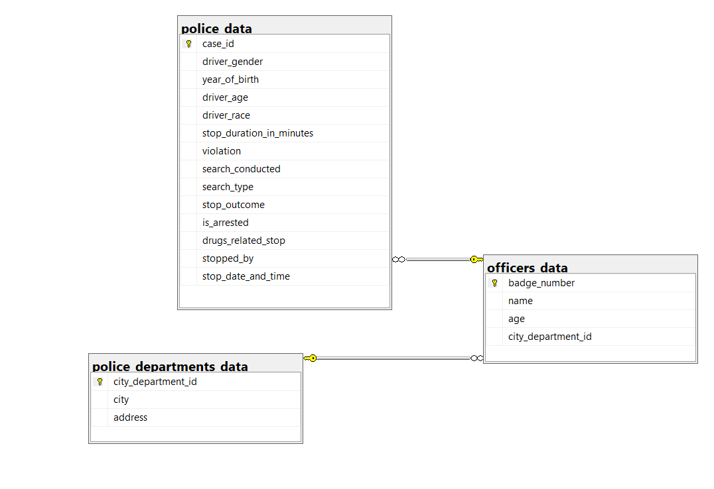

# Police Dataset Project

## Overview

This repository contains an analysis of a police dataset, starting with a file downloaded from Kaggle. The repository contains the initial dataset file. the data is is then cleaned and manipulated using Jupyter Notebooks with Pandas, Matplotlib and Seaborn Python libraries, two additional dataframes are created for the purpose of building a SQL database. The project also includes exporting dataframes to CSV files, creating a SQL database, and performing queries on the database.

## Table of Contents

- [Project Structure](#project-structure)
- [Cleaning and Exporting Data](#cleaning-and-exporting-data)
- [Creating a SQL Database](#creating-a-sql-database)
- [Database Diagram](#database-diagram)
- [SQL Queries](#sql-queries)
- [License](#license)

## Project Structure

The repository is organized as follows:

- **`starting file/`**: Initial dataset file downloaded from Kaggle.
- **`jupyter notebooks/`**: Jupyter notebooks for data cleaning.
- **`exported cleaned csv files/`**: Exported CSV files.
- **`sql queries for creating database tables/`**: SQL files for database creation, schema setup, and queries.
- **`queries done to the databases/`**: SQL files for database manipulation.
- **`database diagram/`**: Image file of the database diagram.

## Cleaning and Exporting Data

The `jupyter notebooks/` directory contains Jupyter notebooks documenting the process of cleaning the data and exporting it as CSV files. The cleaned starting file is also included in this section.

## Creating a SQL Database

Explore the `sql queries for creating database table/` directory to find the queries dedicated to creating a SQL database. These queries detail the steps taken to make a structured SQL database.

## Database Diagram

The `database diagram/` directory contains a database diagram (`database_diagram.png`) illustrating the structure of the SQL database.

## SQL Queries

The `queries done to the databases/` directory includes SQL file which showcases SQL skills and demonstrate how to retrieve data from the database.

## License

This project is licensed under the [MIT License](LICENSE). See the [LICENSE](LICENSE) file for details.

---

Feel free to customize this template further to include more specific details about your project, dependencies, or instructions for running the notebooks and SQL scripts.

